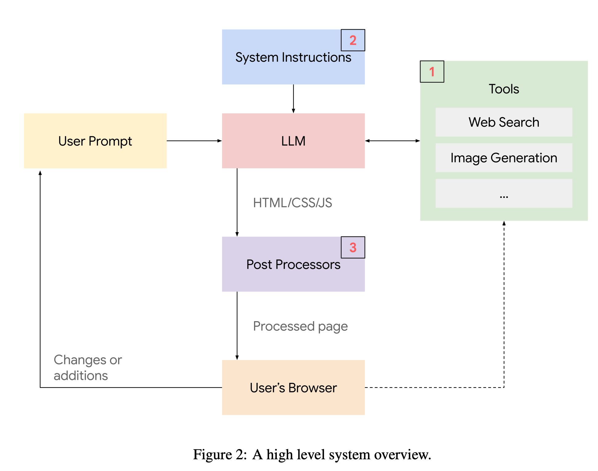

# OpeHarmonyAssistant

OpeHarmonyAssistant 是一个类似于 Gemini-3-pro 的高级智能助手，专注于为 OpenHarmony 生态系统生成**富交互式、视觉化**的用户界面。

与传统仅返回文本的 AI 助手不同，OpeHarmonyAssistant 的核心目标是直接构建**完整的、可交互的 HTML 应用程序**来解决用户的查询。

## 🌟 核心特性

*   **交互式 UI 生成 (Generative UI):** 将用户的自然语言请求转化为功能完备的 Web 应用（如动态时钟、交互式地图、数据仪表盘等）。
*   **实时数据集成:** 强制对实体和事实进行实时搜索验证，确保生成内容的准确性和时效性。
*   **多媒体融合:**
    *   **图片生成 (`/gen`):** 自动为抽象概念或插图生成 AI 图像。
    *   **图片检索 (`/image`):** 自动搜索并展示特定人物、地点或实物的真实照片。
*   **现代设计:** 默认集成 Tailwind CSS，确保生成的界面美观、响应式且符合现代设计规范。

## 💡 设计理念

本项目遵循以下核心设计原则（参考自 System Prompt）：

1.  **Build Interactive Apps First:** 即使是简单的问题（如“现在几点？”），也应返回一个动态的时钟应用，而非静态文本。
2.  **No Walls of Text:** 避免长篇大论的文字，尽可能使用视觉元素和交互组件来传达信息。
3.  **Fact Verification (Mandatory):** 所有涉及实体、数据或新闻的内容必须经过搜索验证，严禁幻觉（Hallucination）。
4.  **No Placeholders:** 拒绝使用 Lorem Ipsum 或占位符图片，所有内容必须是真实的或通过 AI 生成的。

## 🚀 使用示例

OpeHarmonyAssistant 能够处理各种复杂的生成任务：

| 用户请求 | 助手生成的应用 |
| :--- | :--- |
| "什么是OpenHarmony?" | 一个**交互式技术百科页**，包含可视化的分层技术架构图（内核/系统服务/框架/应用层）、支持折叠/展开的子系统详情、以及轻量/小型/标准系统的特性对比卡片。 |
| "现在几点了？" | 一个带有动态指针、支持多时区切换的**时钟应用**。 |
| "我要去新加坡旅游，住在洲际酒店，想要一条慢跑路线。" | 一个集成 Google Maps 的**交互式地图**，标注了酒店、景点并绘制了推荐的慢跑路径。 |
| "介绍一下巴拉克·奥巴马的家庭。" | 一个动态的**家谱树**或**时间轴应用**，包含家庭成员的真实照片和生平简介。 |
| "模拟一个蚁群。" | 一个基于 HTML5 Canvas 的 **2D 模拟器**，用户可以调整蚂蚁数量和食物源。 |
| "生成一个关于外星人交朋友的儿童绘本。" | 一个图文并茂的**数字故事书**，包含一致的角色设计和 AI 生成的插图。 |

## 🛠️ 技术细节

助手通过特定的 System Instructions (详见 [`reference.md`](./reference.md)) 运作，输出格式严格遵循以下标准：

*   **输出格式:** 纯 HTML 代码，包裹在 ` ```html ... ``` ` 标记中。
*   **样式框架:** Tailwind CSS (CDN 引入)。
*   **脚本能力:** 支持原生 JavaScript，用于实现逻辑、动画和数据处理。
*   **API 接口:**
    *   图片生成: `src="/gen?prompt=..."`
    *   图片搜索: `src="/image?query=..."`

## 📖 参考文献

[Generative UI Paper](https://generativeui.github.io/static/pdfs/paper.pdf)

### 2 方法



我们的 Generative UI 实现输出一个完整的生成网页以及一组伴随的资源（例如图像）。该网页在用户的浏览器上原样渲染。系统的高层概览见图 2。

如图 2 所示，我们主要使用 3 个组件：

1.  一个服务器，公开几个端点以支持访问关键工具，例如图像生成和搜索。结果可以提供给模型（提高质量）或直接发送到用户的浏览器（提高效率）。
2.  精心设计的系统指令。这些指令包括：(1) 目标，(2) 规划和思考指南，(3) 示例，以及 (4) 大量技术说明，包括格式指南、工具端点手册和避免常见错误的提示。这些有助于提高生成结果的质量（参见附录 A.5，了解早期研究原型的说明性提示）。
3.  一组后处理器。这些轻量级组件解决了一组剩余的常见问题。其他后处理器处理错误报告和页面分析。参见附录 A.6。

#### 2.1 一致的样式

如果需要，我们的设置允许使用特定的样式生成结果，并提高各代之间的视觉一致性。这是通过对系统指令进行微小更改来完成的。具体来说，我们尝试用更详细的变体（我们称之为“Classic”和“Wizard Green”）替换提示中简短的“Style”部分，指定颜色、字体等。我们观察到生成的结果确实遵循这些样式。有趣的是，模型会自动调整所有元素，包括生成的图像和图标，以适应所需的样式。参见图 3 和 4。

### 3 结果

我们评估了用户对几种不同结果格式的偏好：人类专家为提示制作的定制网站（见第 4 节）、查询的顶级 Google 搜索结果、文本（无 Markdown 的 LLM 输出）、标准 LLM 输出（Markdown 格式）以及我们的 Generative UI 实现。我们从 LMArena [Chiang et al., 2024] 随机抽取了 100 个提示（排除了 8 个查询，见附录 A.4），并从人类评估者那里收集了成对偏好，每个结果发送给 2 名评估者。生成时间不是评估因素，我们向评估者展示预缓存的结果。我们要求人类评估者按 3 分制进行评分：左侧首选、中立、右侧首选。

除了 LMArena 提示外，我们还创建了一个由信息搜索提示组成的自定义提示集（见附录 A.3）。我们使用相同的方法对这两组进行了评估。关于我们 Generative UI 实现的精选生成示例，请参见附录 A.1。

表 1 和表 2 显示了 LMArena 提示的每种 UI 模式的 ELO 分数和并排用户偏好。Generative UI 获得了 1710.7 的 ELO 分数，表明除了人类专家之外，用户对其他所有格式都有强烈的偏好。值得注意的是，与 Markdown UI（次优方法）相比，Generative UI 在 82.8% 的情况下更受青睐。关于信息搜索提示集的评估结果（对我们实现的偏好为 92.6%），请参见附录表 6 和 7。

**表 1：用户偏好 ELO 分数 (LMArena)**

| 格式 | ELO 分数 |
| :--- | :--- |
| Website (human expert) | 1756.0 |
| Generative UI | 1710.7 |
| Generative Markdown | 1459.6 |
| Website (top search result) | 1355.1 |
| Generative Text | 1218.6 |

**表 2：成对用户偏好胜率 (LMArena)。Generative UI 受到强烈偏好，仅次于人类专家。**

| Method | Website (experts) | Generative UI | Markdown | Website (search) | Text |
| :--- | :--- | :--- | :--- | :--- | :--- |
| Website (experts) | - | 56.0% | 84.4% | 89.1% | 94.0% |
| Generative UI | 43.0% | - | 82.8% | 90% | 97.0% |
| Markdown | 15.6% | 13.9% | - | 44.4% | 81.1% |
| Website (search) | 4.9% | 6.7% | 52.2% | - | 58.9% |
| Text | 2.7% | 3.0% | 1.1% | 38.3% | - |

#### 3.1 涌现能力

我们消融了骨干模型的重要性，并表明 Generative UI 是较新模型的一种涌现能力。在表 3 和表 4 中，我们看到用户对新 Gemini 模型结果的强烈偏好以及更少的错误。

**表 3：模型性能比较 (LMArena)**

| Backbone Model | Elo Score | Output Errors |
| :--- | :--- | :--- |
| Gemini 3 | 1706.7 | 0% |
| Gemini 2.5 Pro | 1653.6 | 0% |
| Gemini 2.5 Flash | 1623.9 | 0% |
| Gemini 2.0 Flash | 1332.9 | 29% |
| Gemini 2.0 Flash-Lite | 1183.0 | 60% |

**表 4：模型性能比较 (Info-Seeking)**

| Backbone Model | Elo Score | Output Errors |
| :--- | :--- | :--- |
| Gemini 3 | 1739.31 | 0% |
| Gemini 2.5 Pro | 1578.53 | 0% |
| Gemini 2.5 Flash | 1577.74 | 0% |
| Gemini 2.0 Flash | 1361.75 | 0% |
| Gemini 2.0 Flash-Lite | 1242.67 | 1% |

#### 3.2 提示消融

我们分析了提示策略的影响。首先，我们比较了一个最小提示，该提示仅指示模型如何使用图像搜索和图像生成，以及如何输出有效的 HTML。评估者在更多情况下更喜欢使用完整提示生成的 UI。接下来，我们删除了完整提示的特定部分，包括核心理念和相应的示例。详情请见附录中的表 5 和表 8。有趣的是，即使使用最小提示，该模型也足够强大，可以显示出合理的性能。

**表 5：提示策略的影响 (LMArena)**

| Prompt Ablation | ELO Score |
| :--- | :--- |
| Full Prompt | 1553.23 |
| Minimal Prompt | 1496.00 |
| No Philosophy | 1450.77 |

### 4 PAGEN 数据集

为了便于对我们的 Generative UI 实现进行清晰一致的评估，我们将结果与人类专家制作的网站进行了比较。为此，我们针对样本提示构建了一个由人类专家制作的网站数据集（使用本文评估中使用的 LMArena 和 Info-Seeking 提示集）。我们将此数据集称为 PAGEN 并将其公开发布，以期鼓励与未来工作进行一致的比较。

我们考虑了几种收集这些人类制作网站的方法，包括利用现有的公共网站、使用预先存在的数据集以及聘请特定提供商开发所有必要的网站。最终，我们选择通过签约在线采购的高评价独立 Web 开发人员来构建我们自己的数据集。这一决定是出于以下愿望：创建特定用户提示与结果网站的清晰配对，保持跨网站的时间和投资的一致性，确保所有用例的清晰一致的准则（例如鼓励交互性和高质量视觉效果），确保用户体验优先且没有任何外部考虑（如 SEO 优化），确保不使用受版权保护的内容，并确保所用工具的一致性（例如我们鼓励使用 AI 工具），以及承包商的多样性和质量。更多详情请参见附录 A.4。

### A.5 系统指令

我们的 Generative UI 实现的一个关键组件是精心设计的系统提示。在这里，我们要包括一个来自早期研究原型的此类指令的说明性示例。这个例子包括大约 3000 个单词，分为 5 个类别：

1.  核心理念
2.  示例
3.  规划指令
4.  技术细节和端点使用（大部分系统指令）。
5.  动态填充的信息，包括日期和用户的位置（如果共享）。

...

#### 中文版系统提示词

完整的中文版系统提示词可参考：[中文版系统提示词](./gemini/system_prompt_zh.md)

#### 英文版系统提示词

完整的英文版系统提示词可参考：[English Version System Prompt](./gemini/system_prompt.md)

### A.6 后处理器

在这里，我们列出了在早期研究原型的生成页面上运行的说明性后处理器。后处理器要么添加对运行服务的支持（例如将相关 API 密钥注入生成的代码），要么修复生成页面的常见问题。

1.  将生成的 API 密钥占位符替换为实际 API 密钥，例如 Google Maps。
2.  注入 Javascript 以检测并报告客户端错误。
3.  修复由于模型解析问题导致的 Javascript 错误。
4.  修复由于缺少 Tailwind CSS 指令导致的 CSS 错误。
5.  修复生成的循环 Tailwind 依赖项。
6.  确保 HTML 属性中的文本字符被正确转义。
7.  删除 Javascript 代码中错误生成的引用。
8.  修复 API 的常见问题（例如地图）。
9.  修复幻觉资产（例如图标）的常见问题。

---
*本项目灵感来源于 Generative UI 研究及 OpenHarmony 交互体验的探索。*
